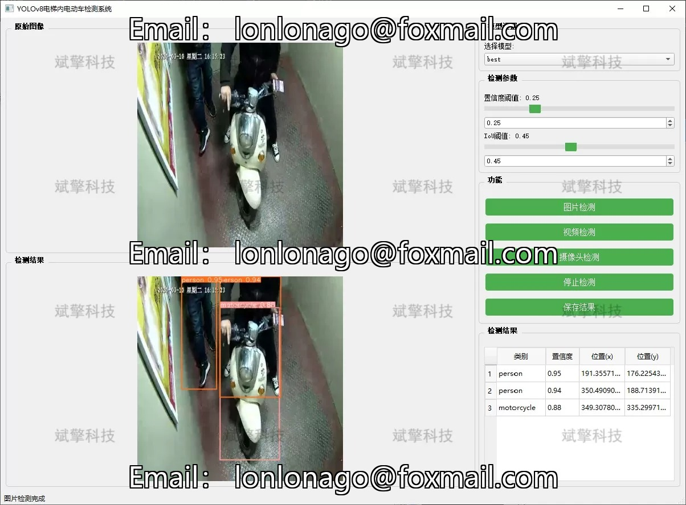
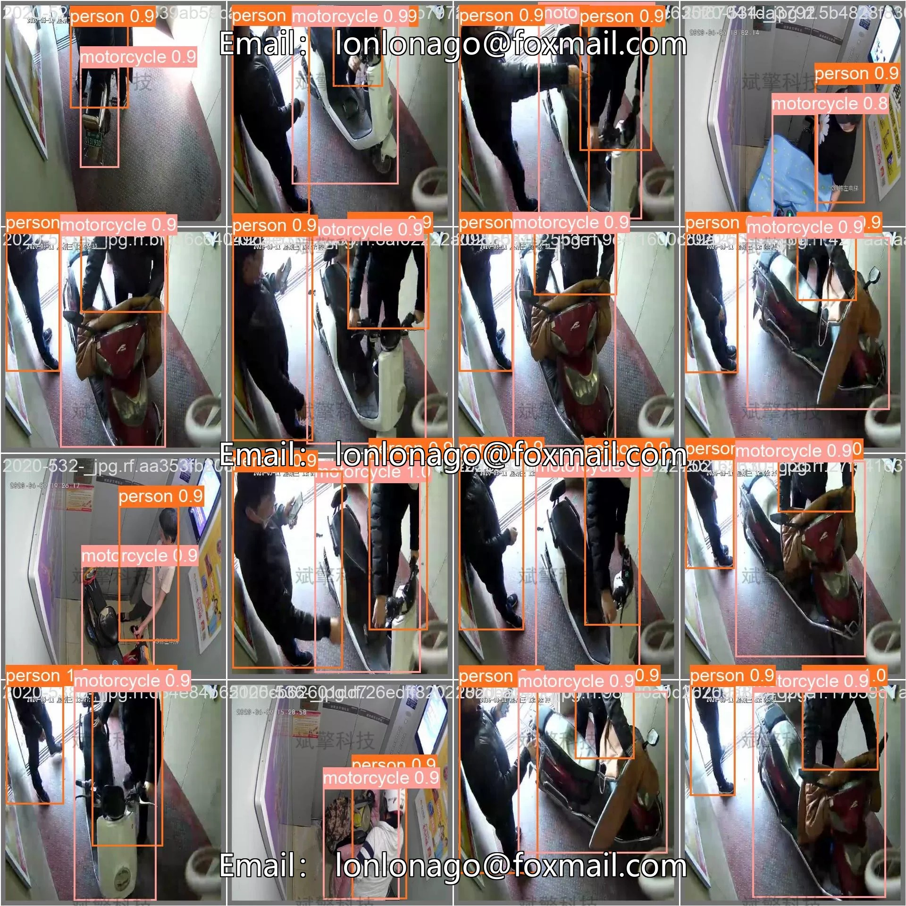

# YOLOv8 Elevator Electric Vehicle Detection System

## Body

YOLOv8 Elevator Electric Vehicle Detection System, based on the YOLOv8 deep learning algorithm, has been developed to detect electric vehicles in elevators.
The system can identify bicycles, motorcycles, and people within elevators in real-time, featuring three major functional modules: image detection, video detection, and real-time camera detection. Through precise target detection and recognition, the system can issue an alarm immediately when an electric vehicle enters the elevator, effectively preventing safety accidents caused by electric vehicle violations and providing reliable technical support for smart communities and intelligent security.

System Features
✅ Image Detection: Can detect images and return detection boxes and category information.
✅ Video Detection: Supports video file input, detecting the situation of each frame in videos.
✅ Real-Time Camera Detection: Connects USB cameras to achieve real-time monitoring.
✅ Parameter Real-Time Adjustment (Confidence and IoU Threshold)
Dataset Overview
Training Set: 5291 images
Validation Set: 1168 images
Test Set: 652 images

## Images

## Payment

Here is a pay link on Stripe ( https://buy.stripe.com/3cs8yP7sY87d0vu9AB ). Please contact me lonlonago@foxmail.com after funding $89, and I will send you a complete data files , thank you!

